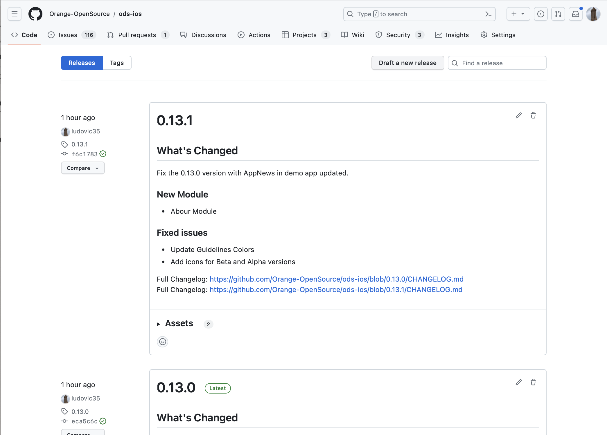

# ODS iOS release guide

This file lists all the steps to follow when releasing a new version of ODS iOS.

- [Prepare release](#prepare-release)
- [Release](#release)
  * [Publish release to GitHub](#publish-release-to-github)
  * [Announce the new release on FoODS](#announce-the-new-release-on-foods)<br /><br />
- [Prepare Next Release]

## Prepare release

- Create a branch named `prepare-release` to prepare the new release for ODS iOS version X.Y.Z.
- Switch to this branch and apply following chnages:
    
    - Update the changelog.

    ```
    \## [Unreleased]\(https://github.com/Orange-OpenSource/ods-ios/compare/P.Q.R...qualif)
    ```
     to

     ```
     \## [X.Y.Z]\(https://github.com/Orange-OpenSource/ods-ios/compare/P.Q.R...X.Y.Z) - YYYY-MM-dd
    ```
    where P.Q.R is the previous version, X.Y.Z the one we are releasing.

    - Update the AppNews file store in the resources of the demo application
    `OrangeDesignSystemDemo/OrangeDesignSystemDemo/Resources/AppNews.json`
    
    Add a new entry:
    ```
    {
        "version": "X.Y.Z",
        "date": "YYYY-MM-dd",
        "news": "Add news here"
    },
    
    ```
    
    - Commit your modifications
    - Push them to the repository
    
- Create a new pull request named `Prepare release X.Y.Z` on GitHub to merge your branch into `qualif`.
- Review and merge this pull request on GitHub.<br /><br />

## Release

- Create a new pull request named `Release X.Y.Z` on GitHub to merge `qualif` into `main`.
- Review and merge this pull request on GitHub.
- Launch a job on your runner to build the demo application
    - Using fastlane command:
    ```
    # Variables for application signing
    export ODS_DEVELOPER_APP_IDENTIFIER=<your_app_identifier>
    export ODS_FASTLANE_APPLE_ID=<your_apple_email_address>
    export ODS_DEVELOPER_PORTAL_TEAM_ID=<your_developer_portal_team_ID>
    
    # Variables to Upload to TestFlight
    export ODS_APPLE_KEY_ID = <your_key_ID>
    export ODS_APPLE_ISSUER_ID = <your_issuer_ID>
    export ODS_APPLE_KEY_CONTENT = <your_key_content>
    
    fastlane prod upload: true"
    # set true if you want to upload app to Test Flight, false otrherwise.
    ```

### Publish release to GitHub

- Go to [GitHub Releases](https://github.com/Orange-OpenSource/ods-ios/releases).

- Click on `Draft a new version`.

    

- Create a new tag X.Y.Z

    

- Add release notes and verify using the preview tab.

- Optionally check `Set as a pre-release` and click `Publish release`.<br /><br />

### Announce the new release on FoODS

- Go to [Teams - FoODS: ODS Mobile iOS](https://teams.microsoft.com/l/channel/19%3a871294014c9f4626bc72d8b7e0f0822a%40thread.tacv2/03-ODS%2520Mobile%2520iOS?groupId=a9581e9e-6775-46f5-9e4a-3ce57096e6be&tenantId=90c7a20a-f34b-40bf-bc48-b9253b6f5d20)

- Post a message with screenshots of new elements to announce the release.

    As Microsoft Teams does not support pasting Markdown, open the text below in a Markdown editor that produces rich text, copy the rich text and paste it to Microsoft Teams. Finally edit the message to display the emojis and add newlines wherever needed.


    > (rocket) Release X.Y.Z is available!
    >
    > **New components**
    >- C8
    >- C9
    >
    >**New module**
    >- M1
    >
    >(page) [Release note](https://github.com/Orange-OpenSource/ods-ios/releases/tag/X.Y.Z)
    >
    >(phone) [Demo app]("http://oran.ge/dsapp")
    >

## [Prepare Next Release]

- Create a branch named `prepare-new-release` to prepare the new release for ODS iOS version U.V.W.

- Switch to this branch and apply following chnages:
    
    - Update the changelog.
    
    Add a section like:
     ```
    \## [Unreleased]\(https://github.com/Orange-OpenSource/ods-ios/compare/X.Y.Z...qualif)
    ```
    
    - Update in Xcode the version of OrangeDesigneSystemDemo targetto U.V.W (the new version)
    - Commit your modifications
    - Push them to the repository
    - Create a new pull request named `Update release U.V.W` on GitHub to merge your branch into `qualif`.
    - Review and merge this pull request on GitHub.<br /><br />
