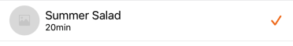

---

**Page Summary**

* Table of contents
{:toc}

---

## Specifications references

- [Design System Manager - Lists](https://system.design.orange.com/0c1af118d/p/09a804-lists/b/669743)
- [Apple guideline - Lists and tables](https://developer.apple.com/design/human-interface-guidelines/components/layout-and-organization/lists-and-tables)

## Accessibility

Please follow [accessibility criteria for development](https://a11y-guidelines.orange.com/en/mobile/ios/)

## Variants
   
Here we just propose a configuration for two types of list items:
- Standard with trailing actions
- Selection with trailing icons (selection indicators) 
  
All items are composed of:
- Title
- Subtitle (optional)
- Leading icon (optional)

The leading icon is :
- icon or image from resources
- Image from url. During image loading a placeholder Image is needed. Three kinds of shape are proposed (circular, square or wide).
    
 
### Standard list item 
 
For standard items, trailing icons can be added. Two types of icons are proposed:
- with text 
- with text and info button to make an action


    
The standard item can be used in a `NavigationLink` (for example, display more details)

#### SwiftUI example

```swift

// Build the List view using ODSListItem withount navigation
List {
    // Items without navigation   
    ODSListItem(title: Text("Title Only")).odsListItemStyle()
    ODSListItem(title: Text("Title with subtitle"), subtitle: Text("subtitle")).odsListItemStyle()    
    ODSListItem(title: Text("Title with leading icon"), leading: .icon(Image(systemName: "heart"))).odsListItemStyle()
    ODSListItem(title: Text("Title with trailing text"), trailingText: Text("Details")).odsListItemStyle()
    ODSListItem(title: Text("Title with trailing text and info button"), trailingText: Text("Details")) {
        // Add info button action here
    }.odsListItemStyle()

    // Item with navigation
    NavigationLink {
        Text("The destination view")
    } label: {
        ODSListItem(title: Text("Title without trailing element"))
    }.odsListItemStyle()
    
    NavigationLink {
        Text("The destination view")
    } label: {
        ODSListItem(title: Text("Title with trailing text"), trailingText: Text("Details"))
    }.odsListItemStyle()
    
    NavigationLink {
        Text("The destination view")
    } label: {
        ODSListItem(title: Text("Title with trailing text and info button"), trailingText: Text("Details")) {
            // Add info button action here
        }
    }.odsListItemStyle()
}
```

### Selection list item




The selection list items can be used to enumerate data as list in order to select elements.

#### SwiftUI example

```swift
struct MyMultipleOptionsSelection: View {

    @State private var optionA: Bool = false
    @State private var optionB: Bool = false
    
    var body: some View {
        List {
            ODSListItem(
                title: Text("Option A"),
                subtitle: Text("Option A description"),
                trailingCheckmarkIsSelected: optionA
            )
            .odsListItemStyle()
            .onTapGesture {
                optionA.toggle()
            }

            ODSListItem(
                title: Text("Option B"),
                subtitle: Text("Option B description"),
                trailingCheckmarkIsSelected: optionB
            )
            .odsListItemStyle()
            .onTapGesture {
                optionB.toggle()
            }
        }
    }
}     
```


#### ODSListItem API

| Parameter                                       | Default&nbsp;value | Description                                       |
|-------------------------------------------------|--------------------|---------------------------------------------------|
| <b>`title: Text`</b>                            |                    | The primary text of the list item.                |
| `subtitle: Text?`                               | `nil`              | The secondary (optional) text of the list item.   |
| `subtitleNumberOfLines: SubtitleNumberOfLines?` | `.one`             | To limit the subtitle text to 1 or 2 lines.       |
| `leading: Self.Leading?`                        | `nil`              | The leading icon (optional) of the list item.     |
| `trailing: Self.Trailing?`                      | `nil`              | The trailing element (optional) of the list item. |

**Note 1:** Don’t forget, if item is used in a `NavigationLink`, a chevron is automatically added by the system. For design purpose it is NOT recommended to add item with `trailingCheckmarkIsSelected` and `trailingToggleIsOn` parameters in a `NavigationLink`.

**Note 2:**Don’t forget to apply the style on: 
- __ODSListItem__ if it is not used with NavigationLink.
- NavigationLink if __ODSListItem__ is its label.

