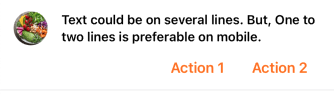
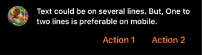

---

**Page Summary**

* Table of contents
{:toc}

---

A banner displays an important, succinct message, and provides actions for users to address (or dismiss the banner). It requires a user action to be dismissed.

Banners should be displayed at the top of the screen, below a top app bar. They’re persistent and nonmodal, allowing the user to either ignore them or interact with them at any time. Only one banner should be shown at a time




## Specifications references

- [Design System Manager - Banners](https://system.design.orange.com/0c1af118d/p/85a52b-components/b/1497a4)

## Accessibility

Please follow [accessibility criteria for development](https://a11y-guidelines.orange.com/en/mobile/ios/)

## Variants

### Two buttons

Button are placed under the text.

#### SwiftUI examples

- Without image

```swift
ODSBanner(text: "One to two lines is preferable on mobile and tablet.") {
    Button("Button 1") {
        // your action here
    }
} secondButton: { 
    Button("Button 1") {
        // your action here
    }
}
```

- with image from resourcess
 
```swift
ODSBanner(text: "One to two lines is preferable on mobile and tablet.",
         imageSource: .image(Image("placeholder", bundle: Bundle.ods))) {
    Button("Button 1") {
        // your action here
    }
} secondButton: { 
    Button("Button 1") {
        // your action here
    }
}
```


- With image from url

```swift

let placeholder = Image("placeholder", bundle: Bundle.ods)
let url = URL(string: "https://images.unsplash.com/photo-1615735487485-e52b9af610c1?ixlib=rb-4.0.3&ixid=MnwxMjA3fDB8MHxwaG90by1wYWdlfHx8fGVufDB8fHx8&auto=format&fit=crop&w=774&q=80")

ODSBanner(text: "One to two lines is preferable on mobile and tablet.",
         imageSource: .asyncImage(url, placeholder)) {
    Button("Button 1") {
        // your action here
    }
} secondButton: { 
    Button("Button 1") {
        // your action here
    }
}
```

#### ODSBanner API

| Parameter                           | Default&nbsp;value                                                                | Description                                                                       |
|-------------------------------------|-----------------------------------------------------------------------------------|-----------------------------------------------------------------------------------|
| <b>`text: Text`</b>                 |                                                                                   | Text displayed into the banner.                                                   |
| `imageSource: ODSImage.Source?`     | `nil`                                                                             | Image displayed in the banner in a circle shape.                                  |
| `firstButton: Button<Text>`         |                                                                                   | Primary (leading) button displayed in the banner.                                 |
| `secondButton: Button<Text>`        |                                                                                   | Secondary (trailing) button displayed into the banner next to the primary one.    |

### One button

The button is placed under the text.

#### SwiftUI example

```swift
ODSBanner(text: "One to two lines is preferable on mobile and tablet.",
         imageSource: .image(Image("placeholder", bundle: Bundle.ods))) {
             Button("Button") {
                 // your action here
             }
}
```

#### ODSBanner API

| Parameter                           | Default&nbsp;value                                                                | Description                                                                       |
|-------------------------------------|-----------------------------------------------------------------------------------|-----------------------------------------------------------------------------------|
| <b>`text: Text`</b>                 |                                                                                   | Text displayed into the banner.                                                   |
| `imageSource: ODSImage.Source?`     | `nil`                                                                             | Image displayed in the banner in a circle shape.                                  |
| `button: Button<Text>`              |                                                                                   | Primary button displayed in the banner.                                           |


### No button

#### SwiftUI example

```swift
ODSBanner(text: "One to two lines is preferable on mobile and tablet.",
         imageSource: .image(Image("placeholder", bundle: Bundle.ods)))
```

#### ODSBanner API

| Parameter                           | Default&nbsp;value                                                                | Description                                                                       |
|-------------------------------------|-----------------------------------------------------------------------------------|-----------------------------------------------------------------------------------|
| <b>`text: Text`</b>                 |                                                                                   | Text displayed into the banner.                                                   |
| `imageSource: ODSImage.Source?`     | `nil`                                                                             | Image displayed in the banner in a circle shape.                                  |

