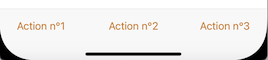
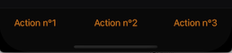
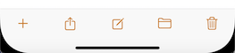
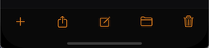

---

**Page Summary**

* Table of contents
{:toc}

---

## Specifications references

- [Design System Manager - Bars: tool](https://system.design.orange.com/0c1af118d/p/06c413-bars-tool/b/951e5c)
- [Apple guideline - Tool bars](https://developer.apple.com/design/human-interface-guidelines/ios/bars/toolbars/)

## Accessibility

Please follow [accessibility criteria for development](https://a11y-guidelines.orange.com/en/mobile/ios/)

## Variants

A tool bar allows users to do specific actions regarding the entire page. It is placed at the bottom of the screen. It can display 2 to 5 icon controls or 2 to 3 label entries.

### With label items

 

A tool bar can display 2 to 3 label entries.

Example with 3 label entries in toolBar :

```swift

let description1 = ODSToolbarLabelDesription(text: "Action 1") { }
let description2 = ODSToolbarLabelDesription(text: "Action 2") { }
let description3 = ODSToolbarLabelDesription(text: "Action 3") { }

let labelItems = ODSToolbarLabeledItems(description1: description1,
                                        description2: description2,
                                        description3: description3)
NavigationView {
    ContentView()
    .navigationBarTitle("", displayMode: .inline)
    .navigationBarHidden(true)
    .odsToolBar(items: labelItems)
}

//  To remove navigation bar, use following modifiers
//  .navigationBarHidden(true)

```

#### odsToolBar Modifier API

| Parameter                           | Default&nbsp;value                                                                | Description                                                                       |
|-------------------------------------|-----------------------------------------------------------------------------------|-----------------------------------------------------------------------------------|
| `items: ODSToolbarLabeledItems`     |                                                                                   | Text items displayed into the banner.                                             |


#### ODSToolbarLabeledItems API

| Parameter                           | Default&nbsp;value                                                                | Description                                                                       |
|-------------------------------------|-----------------------------------------------------------------------------------|-----------------------------------------------------------------------------------|
| `description1: ODSToolbarLabelDesription` |                                                                             | Primary description of item in tool bar                                           |
| `description2: ODSToolbarLabelDesription` |                                                                             | Secondary description of item in tool bar                                         |
| `description3: ODSToolbarLabelDesription?`| nil                                                                         | Terciary (optional) description of item in tool bar                               |

#### ODSToolbarLabelDesriptionF API

| Parameter                           | Default&nbsp;value                                                                | Description                                                                       |
|-------------------------------------|-----------------------------------------------------------------------------------|-----------------------------------------------------------------------------------|
| `text: String                       |                                                                                   | Text displayed in the item                                                        |
| `action: @escaping () -> Void`      |                                                                                   | Action when item is clicked                                                       |
<BR>

### With icon items

 

A tool bar can display 2 to 5 icon controls
```swift

let description1 = ODSToolbarIconDesription(systemName: "plus") { }
let description2 = ODSToolbarIconDesription(systemName: "square.and.arrow.up") { }
let description3 = ODSToolbarIconDesription(systemName: "square.and.pencil") { }
let description4 = ODSToolbarIconDesription(systemName: "folder") { }
let description5 = ODSToolbarIconDesription(systemName: "trash") { }

let iconItems = ODSToolbarIconsItems(description1: description1,
                                     description2: description2,
                                     description3: description3,
                                     description4: description4,
                                     description5: description5)
NavigationView {
    ContentView()
    .navigationBarTitle("", displayMode: .inline)
    .navigationBarHidden(true)
    .odsToolBar(items: iconItems)
}

//  To remove navigation bar, use following modifiers
//  .navigationBarHidden(true)

```

#### odsToolBar Modifier API

| Parameter                           | Default value                                                                     | Description                                                                       |
|-------------------------------------|-----------------------------------------------------------------------------------|-----------------------------------------------------------------------------------|
| `items: ODSToolbarIconItems`        |                                                                                   | Icon items displayed into the banner.                                             |


#### ODSToolbarIconsItems API

| Parameter                                | Default value                                                                | Description                                                                       |
|------------------------------------------|------------------------------------------------------------------------------|-----------------------------------------------------------------------------------|
| `description1: ODSToolbarIconDesription` |                                                                              | First description of item in tool bar                                             |
| `description2: ODSToolbarIconDesription` |                                                                              | Second description of item in tool bar                                            |
| `description3: ODSToolbarIconDesription?`| nil                                                                          | Third (optional) description of item in tool bar                                  |
| `description4: ODSToolbarIconDesription?`| nil                                                                          | Fourth (optional) description of item in tool bar                                 |
| `description5: ODSToolbarIconDesription?`| nil                                                                          | Fifth (optional)  description  of item in tool bar                                |


#### ODSToolbarIconDesription API

| Parameter                           | Default value                                                                     | Description                                                                       |
|-------------------------------------|-----------------------------------------------------------------------------------|-----------------------------------------------------------------------------------|
| `systemName: String                 |                                                                                   | System name of the image                                                          |
| `action: @escaping () -> Void`      |                                                                                   | Action when item is clicked                                                       |
<BR>


## Remarks
 
As toolbar colors depends on theme, don't forget to add it to enviroment and call the view modifier __.toolBarColors(for:)__ to apply colors provided by the theme.

Two solutions:

- Directy on the root view

```swift
let theme = YourTheme()

ContentViewWithToolBar()
.environment(\.theme, theme)
.toolBarColors(for: theme) 
```

- Or using __ODSThemeableView__ view as a root view:

```swift
let theme = YourTheme()

ODSThemeableView(theme: yourTheme) {
    ContentViewWithToolBar()
}
```
