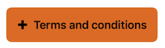
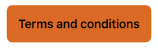
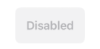
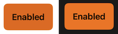
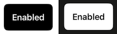
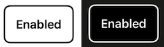
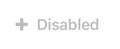
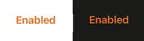
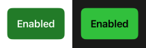
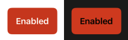

---

**Page Summary**

* [Specifications references](#specifications-references)
* [Accessibility](#accessibility)
* [Variants](#variants)
    * [Emphasis button](#emphasis-button)
    * [Functional button](#functional-button)
    * [Icon button](#icon-button)

---

## Specifications references

- [Design System Manager - Buttons](https://system.design.orange.com/0c1af118d/p/278734-buttons-shape/b/536b5f)
- [Apple guideline - Buttons](https://developer.apple.com/design/human-interface-guidelines/components/menus-and-actions/buttons)

## Accessibility

Please follow [accessibility criteria for development](https://a11y-guidelines.orange.com/en/mobile/ios/)

## Variants

### Emphasis button

Button variants range in style to denote emphasis. Use different styles and not size to show the preferred choice. 

- **Layout**

**Large**


**Small**





 
- **Emphasis**

**High emphasis**




**Medium**




**Low emphasis**




**Lowest emphasis**




- **Implementation**
 
```swift
// High emphasis
ODSButton(text: Text("Some text"),
          image: Image("Add"),
          emphasis: .high) {}

// Lowest emphasis
ODSButton(text: Text("Some text"),
          image: Image("Add"),
          emphasis: .lowest) {}
``` 

### Functional button

If required, colour versions can also be used to inform users of positive or negative destructive actions.

**Positive**

 


**Negative**




```swift
    // Negative button
    ODSFunctionalButton(text: Text("Some text"), style: .negative) 
    { /* action: Do something */ }
    
    ODSFunctionalButton(text: Text("Some text"), image: Image("Add"), style: .negative)
    { /* action: Do something */ }
    
    // Positive button
    ODSFunctionalButton(text: Text("Some text") style: .positive)
    { /* action: Do something */ }
    
    ODSFunctionalButton(text: Text("Some text"), image: Image("Add"), style: .positive)
    { /* action: Do something */ }
    
    // To disable the button
    ODSFunctionalButton(text: Text("Some text"), style: .positive) { /* action: Do something */ }
    .disabled(true)
```

### Icon button

Plain buttons are the most ubiquitous component found throughout applications. Consisting an icon, they are the most simple button style.


```swift
// icon with system asset
ODSIconButton(image: Image(systemName: "info.circle")) {}

// icon with Solaris asset
ODSIconButton(image: Image("Add")) {}
```


