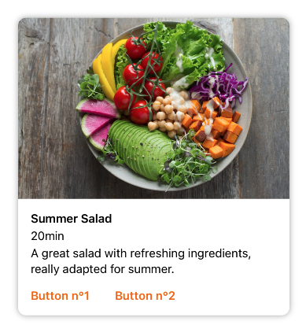
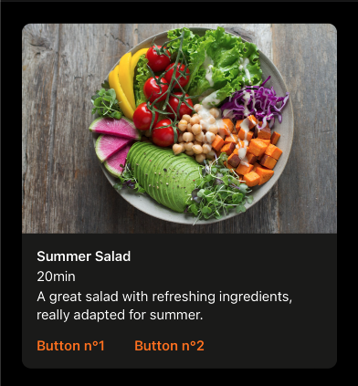
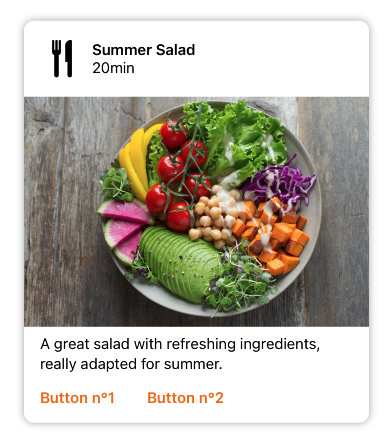
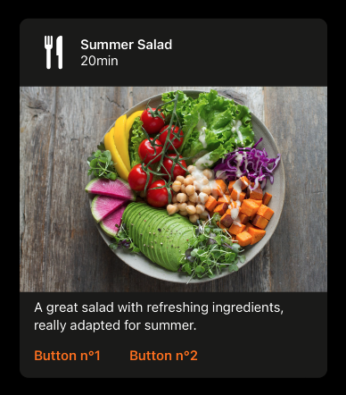
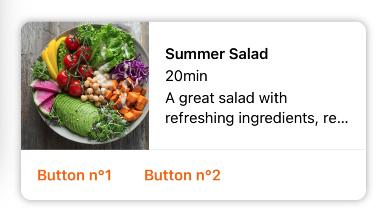
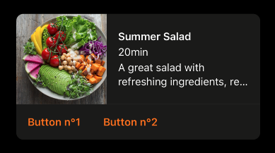
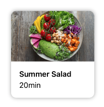
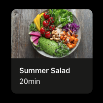

---

**Page Summary**

* [Specifications references](#specifications-references)
* [Accessibility](#accessibility)
* [Variants](#variants)
    * [Vertical Image First Card)](#vertical-image-first-card)
    * [Vertical Header First Card)](#vertical-header-first-card)
    * [Horizontal Card](#horizontal-card)
    * [Small Card](#small-card)
* [Component specific tokens](#component-specific-tokens)

---

## Specifications references

- [Design System Manager - Cards](https://system.design.orange.com/0c1af118d/p/66bac5-cards/b/1591fb)

## Accessibility

Please follow [accessibility criteria for development](https://a11y-guidelines.orange.com/en/mobile/ios/)

Images in cards are considered as decorative, so they are ignored by Voice Over.

## Variants

Cards are a contained and independent element that can display content and actions on a single topic.

There are a few ways cards can be presented. Ranging from a single title on its own for a simple card view or with more information shown in a subtitle and supporting text and actions at the bottom of the card.


### Vertical Image First Card

This is a full width card displayed with an image as first element.

This card is composed of two parts:
- Media: (today an image)
- Content: with a title, an optional subtitle an optional supporting text and optional buttons (zero up to two)

 

> **Implementation**

Card is configured like this:

```swift
ODSCardVerticalImageFirst(
    title: Text("Title"),
    imageSource: .image(Image("ods_empty", bundle: Bundle.ods)),
    subtitle: Text("Subtitle"),
    text: Text("A supporting text to describe something")
) {
   Button("Button 1") {
        // do something here
    }
} secondButton: {
    Button("Button 2") {
        // do something here 
    }
}
```

### Vertical Header First Card

This is a full width card displaying with a title and a thumbnail on top as first element.

This card is composed of three parts:
- Header: with a title, an optional subtitle and an optional thmubnail
- Media: (today an image)
- Content: with an optional supporting text and optional buttons (zero up to two)

 

> **Implementation**

Card is configured like this:

```swift
    
ODSCardVerticalHeaderFirst(
    title: Text("Title"),
    imageSource: .image(Image("ods_empty", bundle: Bundle.ods)),
    subtitle: Text("Subtitle"),
    thumbnailSource: .image(Image("ods_empty", bundle: Bundle.ods)),
    text: Text("A supporting text to describe something")
) {
   Button("Button 1") {
        // do something here
    }
} secondButton: {
    Button("Button 2") {
        // do something here 
    }
}
```

### Horizontal Card

This is a full width card displaying with image on left and content with texts on the right. Additonal action buttons can be added at the bottom of the card. 

Thes content is composed by:
- a title
- an optional subtitle
- an optional text for larger description

 

> **Implementation**

Card is configured like this:

```swift    
ODSCardHorizontal(
    title: Text("Title"),
    imageSource: .image(Image("ods_empty", bundle: Bundle.ods)),
    imagePosition: .leading,
    subtitle: Text("Subtitle"),
    text: Text("A supporting text to describe something")
) {

    Button("Button 1") {
            // do something here
    }
} secondButton : {
    Button("Button 1") {
        // do something here
    }
}
```

### Small Card  

The small card if prefered for two-column portrait mobile screen display.
As it is smaller than full-width cards, it contains only title and subtitle (optional) in one line (Truncated tail).

 

> **Implementation**

Card is configured like this:

```swift
ODSCardSmall(
    title: Text("Title"),
    imageSource: .image(Image("ods_empty", bundle: Bundle.ods)),
    subtitle: Text("Subtitle")
) 
```

How to add Small Card in Grid 

```swift
class Model {
    let title: String
    let subtitle: String?
    let imageSource: ODSImage.Source
    
    init(title: String, imageSource: ODSImage.Source, subtitle: String? = nil) {
        self.title = title
        self.imageSource = imageSource
        self.subtitle = subtitle
    }
}


let models = [
    Model(
        title: "Title 1",
        imageSource: .image(Image("ods_empty", bundle: Bundle.ods)),
        subtitle: "Subtitle 1"
    )
    Model(
        title: "Title 2",
        imageSource: .image(Image("ods_empty", bundle: Bundle.ods)),
        subtitle: "Subtitle 2"
    )
    //...
]

/// /!\ Don't forget to put the grid into a scrollview
ScrollView {
    LazyVGrid(columns: columns, spacing: ODSSpacing.none) {
        ForEach(models, id:\.title) { model in
            ODSCardSmall(
                title: Text(model.title),
                imageSource: model.imageSource,
                subtitle: Text(model.subtitle)
            )
        }
    }
    .padding(.all, ODSSpacing.m)
}
 
```

 


