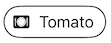
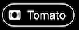
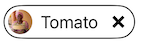
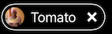
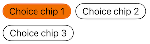
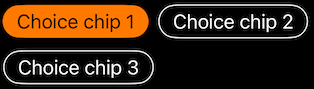
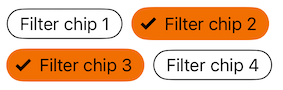
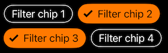
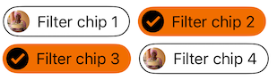
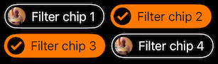

---

**Page summary**

* Table of contents
{:toc}

---

## Specifications references

- [Design System Manager](https://system.design.orange.com/0c1af118d/p/85a52b-components/b/1497a4)

## Accessibility

Please follow [accessibility criteria for development](https://a11y-guidelines.orange.com/en/mobile/ios/)

Chips support dynamic types for accessibility. 

Chips support content labeling for accessibility and are readable by most screen readers. Text rendered in chips is automatically provided to accessibility services. Additional content labels are usually unnecessary.

## Variants

### Action chip

Action chips offer actions related to primary content. They should appear dynamically and contextually in a UI.
An alternative to action chips are buttons, which should appear persistently and consistently.

 


``` swift
ODSActionChip(
    text: Text("chip text"),
    Image(systemname: "heart")
    action: { doSomething() }
)
```

To disable the chip call the `.disabled` on View.

### Input chip

Input chips represent a complex piece of information in compact form, such as an entity (person, place, or thing) or text. They enable user input and verify that input by converting text into chips.




``` swift
// Input chip with leading filled with icon or image for resources

ODSInputChip(
    text: Text(vhip text),
    leadingAvatar: .image(Image("Avatar")),
    action: { doSomething() },
    removeAction: { doSomething() }
)
```

### Choice chip

Choice chips allow selection of a single chip from a set of options. Choice chips clearly delineate and display options in a compact area.

**Note: To display a set of choice chips please see ODSChoiceChipsPicker**




``` swift
enum Ingredient: String, CaseIterable {
    case chocolate, vanilla, strawberry
}

ODSChoiceChipView(
    chip: ODSChoiceChip(text: Text("Chocolate"), value: .chocolate),
    selected: false:
    action: { doSomething() }
)
ODSChoiceChipView(
    chip: ODSChoiceChip(text: Text("Vanilla"), value: .vanilla),
    selected: true:
    action: { doSomething() }
)
```

In order to display a set of choice chips you can follow this example:

``` swift
@State var selection: Ingredient

var body: some View {
    ScrollView(.horizontal) {
        ForEach(Ingredient.allCases, id: \.rawValue) { ingredient in
            ODSChoiceChipView(
                model: ODSChoiceChip(text: Text(ingredient.rawValue), value: ingredient),
                selected: selection == ingredient,
                action: { selection = ingredient }
            )
        }
    }
}
```

To simplify the chips placement and alignment, you can also use the __ODSChoiceChipsPicker__ like this:

``` swift
@State var selection: Ingredient

ODSChoiceChipPicker(
    title: Text("Select your ingredient"),
    chips: Ingredient.allCases.map { ODSChoiceChip(text: Text($0.rawValue), value: $0) 
    selection: $selection,
    placement: .carousel
)
```

### Filter chip

Filter chips use tags or descriptive words to filter content. Filter chips allow selection of a set of chips from a set of options. Its usage is usefull to apply a filtering on a list of elmeents.

**Note: To display a set of filter chips please see ODSFilterChipsPicker**

 

 


``` swift
enum Ingredient: String, CaseIterable {
    case chocolate, vanilla, strawberry
    
    var image: Image {
        Image("self.rawValue")
    }
} 

ODSFilterChipView(
    chip: ODSFilterChip(text: Text("Chocolate"), leading: .image(Image("avatar")), value: .chocolate),
    selected: false:
    action: { doSomething() }
)
```

As the choice chip, to simplify the chips placement and alignment, you can also use the __ODSFilterChipsPicker__ like this: 

``` swift
@State var selection: [Ingredient]

ODSFilterChipPicker(
    title: Text("Select your ingredients"),
    chips: Ingredient.allCases.map { ODSFilterChip(text: Text($0.rawValue), leading(.image($0.image)), value: $0) 
    selection: $selection,
    placement: .carousel
)
```

