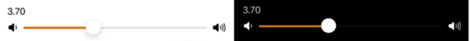

---

**Page Summary**

* Table of contents
{:toc}
  
---

## Specifications references

- [Design System Manager - Sliders](https://system.design.orange.com/0c1af118d/p/7559da-sliders/b/253eea)
- [Apple guideline - Sliders](https://developer.apple.com/design/human-interface-guidelines/components/selection-and-input/sliders)

## Accessibility

Please follow [accessibility criteria for development](https://a11y-guidelines.orange.com/en/mobile/ios/)

As the `ODSSlider` is based on the native `Slider`, Voice Over is able to vocalize 
However, if you want to set a description you need to add it using `.accessibilityLabel` on the `ODSSlider`.

We recommend to not set information on `minimumValueLabel` and `maximumValueLabel` view using `.accessibilityHidden(true)`

## Variants

Slider is a system Slider component with accent color set to coreOrange.



### Unlabeled slider

Unlabelled sliders allow users to make easy selections that do not require any details or context.

```swift
struct UnlabeledSlider: View {

    @State private var value = 50.0

    var body: some View {
        ODSSlider(value: $value, in: 0 ... 100)
    }
}
```

### Labeled slider (with images)

We recommand to not set information on `minimumValueLabel` and `maximumValueLabel` view using `.accessibilityHidden(true)`. You can do it like this:

```swift
struct LabeledSlider: View {

    @State private var value = 50.0

    var body: some View {
        ODSSlider(value: $value, in: 0 ... 100) {
            Text("Volume")
        } minimumValueLabel: {
            Image(systemName: "speaker.wave.1.fill").accessibilityHidden(true)
        } maximumValueLabel: {
            Image(systemName: "speaker.wave.3.fill").accessibilityHidden(true)
        }
    }
}
``` 

### Labeled slider (with text)

We recommand to not set information on `minimumValueLabel` and `maximumValueLabel` view using `.accessibilityHidden(true)`. You can do it like this:

```swift
ODSSlider(value: $value, in: 0 ... 100) {
    Text("Volume")
} minimumValueLabel: {
    Text("0").accessibilityHidden(true)
} maximumValueLabel: {
    Text("100").accessibilityHidden(true)
}
``` 

### Stepped slider (with text and value display)

We recommand to not set information on `minimumValueLabel` and `maximumValueLabel` view using `.accessibilityHidden(true)`. You can do it like this:

```swift
struct SteppedSlider: View {

    @State private var value = 50.0

    var body: some View {
        ODSSlider(value: $value, in: 0 ... 100.0, step: 0.5) {
            Text("Volume")
        } minimumValueLabel: {
            Image(systemName: "speaker.wave.1.fill").accessibilityHidden(true)
        } maximumValueLabel: {
            Image(systemName: "speaker.wave.3.fill").accessibilityHidden(true)
        }
    }
}
``` 
