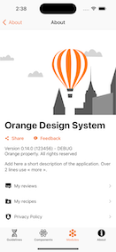

---

**Page Summary**

* [Specifications references](#specifications-references)
* [Overview](#overview)
* [About screen layout](#about-screen-layout)
  * [Illustration area](#illustration-area)
  * [Application section area](#application-section-area)
  * [List items area](#list-items-area)
    * [Mandatory items](#mandatory-items)
    * [Optionnal items](#optionnal-tems)
    * [Custom items](#custom-items)
* [How to configure the module](#how-to-configure-the-module)
  * [Illustration area](#illustration-area)
  * [Application section area](#application-section-area)
  * [List Items area](#list-items-area)
    * [Use mandatory items](#use-mandatory-items)
    * [Add items to the list](#add-items-to-the-list)
    * [Use optional items](#use-optional-items)
    * [Create a custom item](#create-a-custom-item)

---

## Specifications references

- [Design System Manager - Modules - About](https://system.design.orange.com/0c1af118d/p/39538b-about/b/55a5d2)

## Overview

This module should be added in all applications to display general application information (name, software version, description, privacy policy, terms of service, ...), to offer user actions (Rate the app, send feedbacks, ...), to get informaioon linked to the service (Application recirculation, App news ...).

It is also possible to add to the module some specifc features linked to the service provided by the application (Suppport, How to, settings, ...) 

In order to have consistant prsentation of those elemnts in all applications, the __About__ module offers a structured and configrable layout.




## About screen layout

The main about screen is divided to three areas.

### Illustration area

The first area (at the top of the screen) allows you to set an image illustrating the about screen linked to the service. If no image is provided the default one is inserted automatically.

### Application information area

The second area is dedicated for the application description with various elements:
- The name (mandatory)
- The version (optional)
- A description in sevral lines (optional) 


It is also possible to activate two buttons to offer to the user to:

- _share the application_ via email, via sms, via social networks... This button opens the default system share sheet that presents a range of actions to share the application. To activate this button, the developper needs to prvide the url of the application on the store and a short text describing the context of the sharing.
- _send feedback_ to the support of the service. This button is displayed if the developper provides a callback called when button is clicked. This callback can do what it is expected (send email, send sms, open form, open web site, ...).


### List items area

The last area (at the bottom) is a list of items that propose to the user to make actions or navigate to additionnal feetures. 
All items have the same layout (icon and text). They are ordered in the list according to their priority set into the configuration. 

#### Mandatory items

Some items are provided with the module. Three of them are mandatory and allways available in the list:
- Item to present the __Privacy Policy__ (only html content supported today)
- Item to display __Terms of Service__ (View provided by developper)
- Item to show the __Accessibility Statement__ of the application (not available yet)
As those items must be grouped in the list, their priority are fixed and can not be changed.  

#### Optionnal items

As most of applications propose the same additonnal features (Rate the app, App News, ...), and in order to have consitency in about screens of all applications, additional items are proposed with the module.

* Rate the app

This item can be added in the list to redirect the user to the app page on the Apple Store to rate the application.

* Apps news 

This item enumerates the application versions with small text describing new features available.

* Legal inofrmation

This item is used to display legal infomration. Today, there is not recomandation on the presentation.

#### Custom items 

In addition, it is also possible to add into the list some custom items. Like previous ones, they must respect the layout and can set their own priority to be inserted in the right place in the list. 


## How to configure the module

To display the about screen, initialize the module using the __ODSAboutModule__ stucture. During the initialization, a set of configuration must to be provided.

### Illustration area

If the about page needs to display a specific illustration, set it like this:

```swft
ODSAboutModule(headerIllustration: Image("AboutImage"), ...)
```

To keep the default illustration, initialize the module without overriding the `headerIllustration` parameter.


### Application section area

To configure the application, fill out the `ODSAboutApplicationInformation` structure and provide it to the module initialization.

- With name only 

```swift
let nameOnly = ODSAboutApplicationInformation(name: "Orange Design System Demo")
ODSAboutModule(applicationInformation: nameOnly, ...)
```

- With description

```swift
let withDescription = ODSAboutApplicationInformation(
    name: "Orange Design System Demo"
    description: "In this app you'll find implemented code examples of the guidelines, components and modules, for the themes of the Orange Design System.")
ODSAboutModule(applicationInformation: withDescription, ...)
```

- With version

```swift
let version = ODSApplicationVersion(
    marketingVersion: Bundle.main.marketingVersion, // Mandatory
    buildNumber: Bundle.main.buildNumber ?? "", // Optional
    buildType: Bundle.main.buildType // Optional
)

let withVersion = ODSAboutApplicationInformation(
    name: "Orange Design System Demo",
    version: version
)

ODSAboutModule(applicationInformation: withVersion, ...)
```

- To activate the Share the application action

```swift
ler shareTheApplicationConfiguration = ODSAboutShareTheApplication(
    storeUrl: URL(string: "http://oran.ge/dsapp")!,
    subject: "The Orange Design System",
    description: "Here you will find the Orange Design System Mobile App that provides examples of design implementations"
)

let withShareTheApp = ODSAboutApplicationInformation(
    name: "Orange Design System Demo",
    shareConfiguration: shareTheApplicationConfiguration
)
ODSAboutModule(applicationInformation: withShareTheApp, ...)
```

- To activate the feedback action

```swift

let withFeedback = ODSAboutApplicationInformation(
    name: "Orange Design System Demo",
    onFeedbackClicked: {
        UIApplication.shared.open(URL(string: "https://github.com/Orange-OpenSource/ods-ios/issues/new/choose")!)
    }
)

ODSAboutModule(applicationInformation: withFeedback, ...)
```

### Lits items area

#### Use mandatory items

For the privacy policy display, only html content is supported today. A more structured content will be added soon.

- Privacy policy

```swift
// Initialize the privacy policy page with url of the html file store in resources. 
let privacyPolicy = ODSPrivacyPolicy.webview(.url(Bundle.main.url(forResource: "PrivacyNotice", withExtension: "html")!))
```

- The accessibility statement

```swift
// Still it is not supported, initilaize with fake information 
let acessibilityStatement = ODSAboutAccessibilityStatement(reportPath: "path", reportDetail: URL(string: "https://www.apple.com")!)
```

- The Terms of service

```swift
// Today, there is no recomandation how to display the content, so the module provides a view builder 
// to build a native screen or a webview  

@ViewBuilder
private func termsOfService() -> some View {
    Text("Add terms of service here")
}
```

Then initialize the module with those mandatory elements:

```swift
ODSAboutModule(...,
   privacyPolicy: privacyPolicy,
   acessibilityStatement: accessibilityStatement,
   termsOfService: termOfService
)
```

#### Add items to the list

To insert additionnal items into the list, initialize the __listItemConfigurations__ array adding items following the  __ODSAboutListItemConfig__ protocol.
To order the items in the list, initialize the items with the right priority. 

```swift
// Add all items in list
ODSAboutModule(...,
   listItemConfigurations: [legalInfoItem, rateTheAppItem, appsNewItem]
)

// see items description below
```

#### Use optional items

- Rate the app

To create this item, define the url of the application on the store and the priority (position) of the item in the list:

```swift
// This item opens the store in the external browser
let rateTheAppItem = ODSAboutRateTheAppItemConfig(
   priority: 501,
   storeUrl: URL(string: "https://www.apple.com/app-store/")!
)
```

- Apps news 

To create this item, define the path to the json file containing the news. This file is embeded in the resources of the application. 

The model of the json file is:

```json  
[
    {
        "version": "0.12.0",
        "date": "2023-04-14",
        "news": "A short description of news"
    },
    ...
]
```

This is the code to create the item:

```swift
// - Display the app News 
let appNewFilePath = Bundle.main.path(forResource: "AppNews", ofType: "json")!
let appsNewItem = ODSAboutAppNewsItemConfig(
   priorty: 502, 
   path: appNewFilePath
)
```

- Legal information

Still there is not recomandation on the format of the presentation, this item needs a view builder to display the legal information.
    
```swift
// Here, the legal information are displayed in a view with a single Text.

let legalInformationItem = ODSAboutLegalInformationItemConfig(priority: 500) {
    Text("This is Legal information content")
}
```

- More apps / apps recirculation

You can also add an item to let people discover other apps of Orange, by using the following item:

```swift
let moreAppsItem = ODSMoreAppsItemConfig(feedURL: yourFeederURL)
```

The _feedURL_ is a `URL` object containing the URL of the backend to get the list of apps.
Today the only supported backend is Orange proprietary backend _Apps Plus_.

#### Create a custom item

To create a custom item and associate a target, follow this example:
 
```swift
public struct MyItemToDisplayText: ODSAboutListItemConfig {
    public private(set) var title: String
    public private(set) var icon: Image
    public private(set) var target: ODSAboutListItemTarget
    public private(set) var priority: ODSAboutListItemPriority

    public init(priority: ODSAboutListItemPriority = 100) {
        self.priority = priority
        self.title = "Fake Item"
        self.icon = Image(systemName: "heart"),
        self.target = .destination(AnyView(Text("This is the destination screen")))
    }
}
```

### Configuration of apps recirculation feature

#### Use the feature

The _about module_ exposes a feature allowing the final users to get the available apps they can use.
This feature is based today only on the Orange proprietary _Apps Plus_ backend which provides a JSON file with list of apps and sections of apps.
This service today is based on a simple URL containing both a lang parameter and an API key. 
**This API key will define the type of data returned by the backend ; maybe you should have your own API key which matches the suitable filters to get only a subgroup of apps.**

To be able to call this service and display the list of available apps, you have to use the `ODSMoreAppsItemConfig`.
This _struct_ has a `source` parameter of type `ODSMoreAppsItemConfig.Source` which must contain the type of source of data to display the apps:
                                     
```swift
    // Get data from the Apps Plus backend
    ODSMoreAppsItemConfig(source: .remote(feedURL: "https://url-to-appsplus-backend/get?apikey=SomeKey&lang=fr"))
    
    // Get data for some local files
    ODSMoreAppsItemConfig(source: local(localPath: somePathToJSONFileInResources))
```

Note also that the data picked from the _Apps Plus_ service is saved in cache directory so as to be used if the device is offline
or if an error occured.

If you want to flatten the list of apps without displaying categories, set the _flattenApps_ flag in the configuration:

```swift
let moreAppsItem = ODSMoreAppsItemConfig(source: ..., flattenApps: true)
```  

The apps icons displayed in the list of apps can also be cached.
If you do not want to see these values put in cache, meaning e.g. displaying instead a placeholder if no network, use:

```swift
let moreAppsItem = ODSMoreAppsItemConfig(source: ..., cacheAppsIcons: false)
```

The list of apps can trigger also haptic notifications, e.g. vibrations when the data have been lodaded or if an error occured.
By default this feature is enabled, but it can be disabled:

```swift
let moreAppsItem = ODSMoreAppsItemConfig(source: ..., enableHaptics: false)
```

#### Define some configuration in your app

You can for example for your app use a _AppDemoConfig.xcconfig_ configuration file to store such credentials.
A key named **APPS_PLUS_URL** can be defined with the URL (containing the API key) to call.
Then the **Info.plist** file of your app must have an entry with the same name.
Of course the _AppDemoConfig.xcconfig_ file should not be versionned in Git, but our demo app implements this feature.

See the example for the .xcconfig :

```text
// Configuration settings file format documentation can be found at:
// https://help.apple.com/xcode/#/dev745c5c974
// See also https://medium.com/swift-india/secure-secrets-in-ios-app-9f66085800b4

APPS_PLUS_API_KEY = SoMeApIkEy
APPS_PLUS_URL = https:/$()/url-to-api?apikey=$(APPS_PLUS_API_KEY)

// Here $() prevents the // to be interpreted as comment, we suppose the URL has an apikey parameter and is GET only
```

And the entry for the Info.plist :

```text
    <key>APPS_PLUS_URL</key>
    <string>${APPS_PLUS_URL}</string> <!-- Or write here the full URL with API key but without lang -->
```

Then in our code we just read the URL, get the local, and forge the final URL to give to `ODSMoreAppsItemConfig`.
We could have choosen this implemention deeper in the repository but wanted to let ODS lib users choose their own way to deal with the URL.

```swift
    private func buildAppsPlusURL() -> URL {
        guard let appsPlusURL = Bundle.main.infoDictionary?["APPS_PLUS_URL"] else {
            fatalError("No Apps Plus URL found in app settings")
        }
        let currentLocale = Bundle.main.preferredLocalizations[0]
        let requestURL = "\(appsPlusURL)&lang=\(currentLocale)"
        guard let feedURL = URL(string: requestURL) else {
            fatalError("Failed to forge the service URL to get more apps")
        }
        return feedURL
    }
    
    // And then ODSMoreAppsItemConfig(source: .remote(feedURL: buildAppsPlusURL()))
``
