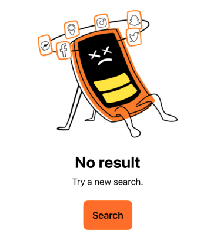
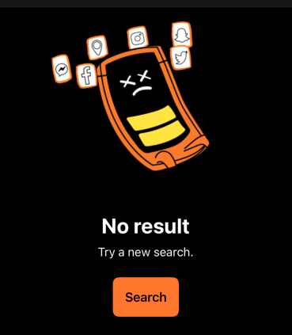

An empty state display should inform the user of what is happening, why it's happening and what to do about it.

<br>**On this page**

* Table of contents
{:toc}

---

## Specifications references

- [Design System Manager - Empty states](https://system.design.orange.com/0c1af118d/p/177496-empty-states/b/454547)

## Accessibility

Please follow [accessibility criteria for development](https://a11y-guidelines.orange.com/en/mobile/ios/).

The ODS Empty states module is built to support accessibility criteria and is readable by most screen readers, such as VoiceOver.

## Integration

 

### SwiftUI

To integrate an ODS Empty state into your app, you can use `ODSEmptyStateView` as shown below:

```swift
ODSEmptyStateView(
    title: Text("No result"),
    text: Text("Try a new search"),
    image: Image("il_emptyStateNoData"),
    button: Button("Search") {
        // Do something
    }
)
```

#### ODSEmptyStateView API

| Parameter                           | Default&nbsp;value                                                                | Description                                                                       |
|-------------------------------------|-----------------------------------------------------------------------------------|-----------------------------------------------------------------------------------|
| <b>`title: Text`</b>              |                                                                                   | The title of the screen displayed below the image. For example "File is missing". |
| `text: Text?`                     | `null`                                                                            | Text displayed below the title                                                    |
| `image: Image`    | `Image("il_yoga_man", bundle: Bundle.ods)` | Image displayed centered in the composable                                        |
| `button: Button<Text>?` | `null`                                                                            | The button to add below the text                                                  |
