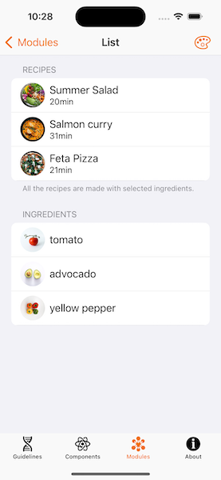
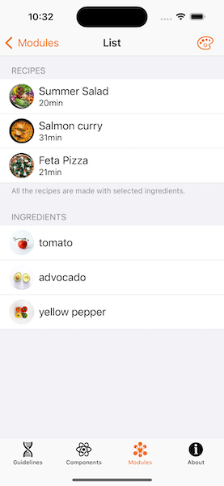
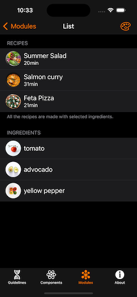
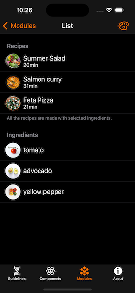
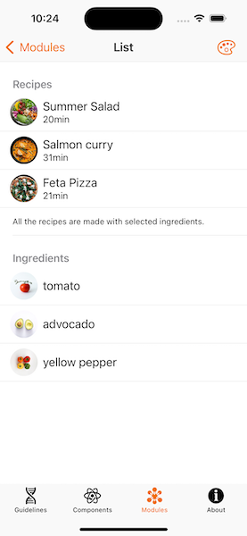
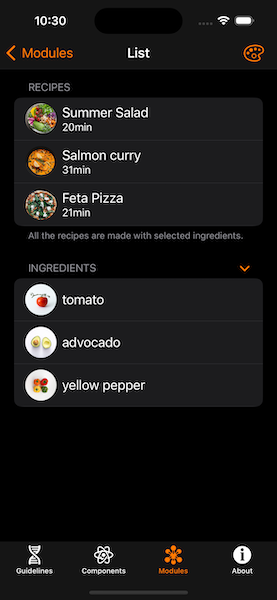

---

**Page Summary**

* [Specifications references](#specifications-references)
* [Accessibility](#accessibility)
* [List styles](#list_styles)
  * [Automatic style](#automatic-style)
  * [Inset Grouped style](#inset-grouped-style)
  * [Grouped style](#grouped-style)
  * [Inset style](#inse-style)
  * [Plain style](#plain-style)
  * [Sidebar style](#sidebar-style)

---

## Specifications references

- [Design System Manager - Lists](https://system.design.orange.com/0c1af118d/p/09a804-lists/b/669743)
- [Apple guideline - Lists and tables](https://developer.apple.com/design/human-interface-guidelines/components/layout-and-organization/lists-and-tables)

## Accessibility

Please follow [accessibility criteria for development](https://a11y-guidelines.orange.com/en/mobile/ios/)

## List styles

List propose the `.listStyle(_:)` modifier to change the style. For ios SwiftUI propose 6 types of style:
- automatic
- insetGrouped
- grouped
- inset
- plain
- sidebar

The folowing code is used for all styles. The only difference is the list style specified in the `.listStyle(_:)` modifier.

```swift
NavigationStack {
    List {
        // Section for recipes contain selected ingredients
        Section {
            ODSListItem(
                title: Text("Summer Salad"),
                subtitle: Text("21 mn"),
                leading: .circularImage(source: .image(Image("summerSalad")))
            )
            ODSListItem(
                title: Text("Salmon cury"),
                subtitle: Text("31 mn"),
                leading: .circularImage(source: .image(Image("salmonCury")))
            )
            ODSListItem(
                title: Text("Feta Pizza"),
                subtitle: Text("21 mn"),
                leading: .circularImage(source: .image(Image("fetaPizza")))
            )
        } header: {
            Text("Recipes")
        } footer: {
            Text("A set of recipes made with selected ingredients")
        }
        
        // A set of ingredients
        Section("Ingredients") {
            ODSListItem(title: Text("tomato"), leading: .circularImage(source: .image(Image("tomato"))))
            ODSListItem(title: Text("avocado"), leading: .circularImage(source: .image(Image("avocado"))))
        }
    }
    .navigationTitle("List Style")
    .listStyle(.automatic)
}
```

### Automatic style

As mentioned earlier, SwiftUI will use Inset Grouped style when setting automatic (.automatic) or DefaultListStyle on iOS

### Inset Grouped style

Example of Inset Grouped .insetGrouped or InsetGroupedListStyle.

```swift
List {
    // ...
}
.listStyle(.insetGrouped)
```




### Grouped style

Example of Grouped .grouped or GroupedListStyle.

```swift
List {
    // ...
}
.listStyle(.grouped)
```




### Inset style

Example of Inset .inset or InsetListStyle.

```swift
List {
    // ...
}
.listStyle(.inset)
```





### Plain style

Example of Plain .plain or PlainListStyle.

```swift
List {
    // ...
}
.listStyle(.plain)
```



### Sidebar style

The sidebar list style displays disclosure indicators in the section headers that allow the user to collapse and expand sections.

Tap on disclosure indicators in the section headers will collapse and expand that section.

```swift
List {
    // ...
}
.listStyle(.sidebar)
```




 
* For iOS 17, a new API is proposed to manage the expandable state.

```swift
@State var isExpanded = true

List {
    Section(isExpanded: $isExpanded) {
        // ...
    } header: {
        Text("Recipes")
    }
}
.listStyle(.sidebar)
```

When you create your Section with `isExpanded`, the chevron will appear as long as the list style is `.sidebar`. 

* On previous iOS versions, this interface is not available, so to do the same you can use following code:

```swift
@State var isExpanded = true

List {
    Section {
        if isExpanded {
            // The content
        }
    } header: {
        HStack {
            Text("Recipes") // The header
            
            Spacer()
            Image(systemName: "chevron.down")
            .rotationEffect(isExpanded ? .zero : .degrees(-90))
            .onTapGesture {
                withAnimation {
                    isExpanded.toggle()
                }
            }
        }
    }
}
.listStyle(.sidebar)
```
 
