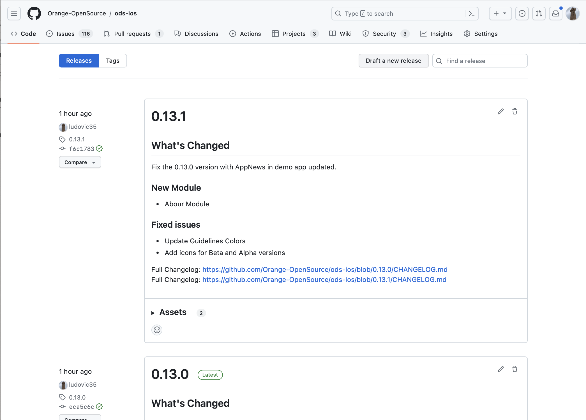
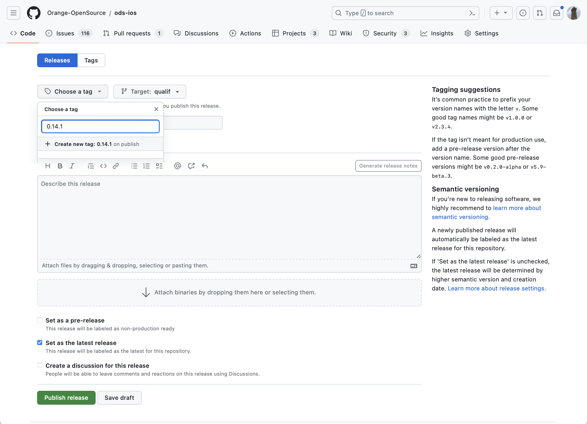

# ODS iOS release guide

This file lists all the steps to follow when releasing a new version of ODS iOS.

- [Prepare release](#prepare-release)
- [Release](#release)
  * [Publish release to GitHub](#publish-release-to-github)
  * [Announce the new release on FoODS](#announce-the-new-release-on-foods)<br /><br />
- [Prepare Next Release]
- [About CI/CD with GitLab CI]

## Prepare release

- Create a branch named `prepare-release` to prepare the new release for ODS iOS version X.Y.Z.
- Switch to this branch and apply following changes:
    
    - Update the changelog.

    ```
    \## [Unreleased]\(https://github.com/Orange-OpenSource/ods-ios/compare/P.Q.R...qualif)
    ```
     to

     ```
     \## [X.Y.Z]\(https://github.com/Orange-OpenSource/ods-ios/compare/P.Q.R...X.Y.Z) - YYYY-MM-dd
    ```
    where P.Q.R is the previous version, X.Y.Z the one we are releasing.

    - Update the AppNews file stored in the resources of the demo application
    `OrangeDesignSystemDemo/OrangeDesignSystemDemo/Resources/AppNews.json`
    
    Add a new entry:
    ```
    {
        "version": "X.Y.Z",
        "date": "YYYY-MM-dd",
        "news": "Add news here"
    },
    
    ```
    - Ensure the marketing version defined in Xcode is updated with the new X.Y.Z
    - Commit your modifications
    - Push them to the repository
    
- Create a new pull request named `Prepare release X.Y.Z` on GitHub to merge your branch into `qualif`.
- Review and merge this pull request on GitHub.<br /><br />

## Release

- Create a new pull request named `Release X.Y.Z` on GitHub to merge `qualif` into `main`.
- Review and merge this pull request on GitHub.
- Launch a job on your runner to build the demo application
    - Using _Fastlane_ command:
    ```shell
    # Variables for application signing
    export ODS_DEVELOPER_APP_IDENTIFIER=<your_app_identifier>
    export ODS_FASTLANE_APPLE_ID=<your_apple_email_address>
    export ODS_DEVELOPER_PORTAL_TEAM_ID=<your_developer_portal_team_ID>
    
    # Variables to Upload to TestFlight
    export ODS_APPLE_KEY_ID = <your_key_ID>
    export ODS_APPLE_ISSUER_ID = <your_issuer_ID>
    export ODS_APPLE_KEY_CONTENT = <your_key_content>
    
    bundle exec fastlane prod upload:true
    # set "upload" to true if you want to upload app to TestFlight, false otrherwise.
    ```

### Publish release to GitHub

- Go to [GitHub Releases](https://github.com/Orange-OpenSource/ods-ios/releases).

- Click on `Draft a new release`.

    

- Create a new tag X.Y.Z

    

- Add release notes and verify using the preview tab.

- Optionally check `Set as a pre-release` and click `Publish release`.<br /><br />

### Announce the new release on FoODS

- Go to [Teams - FoODS: ODS Mobile iOS]

- Post a message with screenshots of new elements to announce the release.

    As Microsoft Teams does not support pasting Markdown, open the text below in a Markdown editor that produces rich text, copy the rich text and paste it to Microsoft Teams. Finally edit the message to display the emojis and add newlines wherever needed.


    > (rocket) Release X.Y.Z is available!
    >
    > **New components**
    >- C8
    >- C9
    >
    >**New module**
    >- M1
    >
    >(page) [Release note](https://github.com/Orange-OpenSource/ods-ios/releases/tag/X.Y.Z)
    >
    >(phone) [Demo app]("http://oran.ge/dsapp")
    >

## [Prepare Next Release]

- Create a branch named `prepare-new-release` to prepare the new release for ODS iOS version U.V.W.

- Switch to this branch and apply following changes:
    
    - Update the changelog.
    
    Add a section like:
     ```
    \## [Unreleased]\(https://github.com/Orange-OpenSource/ods-ios/compare/X.Y.Z...qualif)
    ```
    
    - Update in Xcode the version of OrangeDesignSystemDemo target to U.V.W (the new version you suppose it will be)
    - Commit your modifications
    - Push them to the repository
    - Create a new pull request named `Update release U.V.W` on GitHub to merge your branch into `qualif`.
    - Review and merge this pull request on GitHub.<br /><br />

## [About CI/CD with GitLabCI]

You can setup in your side a _GitLab CI_ runner which can trigger some _Fastlane_ actions for example each night.

You can find bellow some pipeline script to fill and use. Ensure all environement variables are filled (used in _Fastfile_ and _Appfile_).

```yaml
stages:
  - prepare-qualif
  - test-qualif
  - build-qualif
  - prepare-production
  - build-production

.common_qualif:
  tags:
    - xcode15.1
  rules:
    - if: $CI_PIPELINE_SOURCE == "schedule" # Only scheduled pipeline needed

.common_qualif_ios:
  extends: .common_qualif
  before_script:
    # Job fails with allowed error code if IOS_APP_COMMIT_SHA environment variable does not exist.
    # This IOS_APP_COMMIT_SHA variable is defined as environement variable in prepare-{qualif|production}-environment.sh
    - if [[ -z "$IOS_APP_COMMIT_SHA" ]]; then exit 81680085; fi
    - ./download_github_repository.sh Orange-OpenSource ods-ios $IOS_APP_COMMIT_SHA 
    - cd tmp/ods-ios
  allow_failure:
    exit_codes: 81680085

prepare_qualif_environment:
  extends: .common_qualif
  stage: prepare-qualif
  script: ./prepare_qualif_environment.sh
  artifacts:
    reports:
      dotenv: .env
  
test_ios:
  extends: .common_qualif_ios
  stage: test-qualif
  needs: [prepare_qualif_environment]  
  script:
    - cd ./OrangeDesignSystemDemo
    - bundle install
    - bundle exec pod cache clean --all
    - bundle exec pod install
    - bundle exec fastlane ios test

build_ios:
  extends: .common_qualif_ios
  stage: build-qualif
  needs: [prepare_qualif_environment]  
  script:
    - cd ./OrangeDesignSystemDemo
    - bundle install
    - bundle exec pod cache clean --all
    - bundle exec pod install
    - bundle exec fastlane add_credentials_appsplus
    - bundle exec fastlane qualif tagSuffix:$IOS_APP_COMMIT_SHA
    # Creates tags dedicated to the CI/CD builds and TestFlight uploads using some commit hash, e.g. the last commit hash.
    # Will use first characters of the hash, but it might not be enough accurate because some commits may start with same value.

.common_prod:
  tags:
    - xcode15.1

.common_prod_ios:
  extends: .common_prod
  before_script:
    # Job fails with allowed error code if IOS_APP_COMMIT_SHA environment variable does not exist.
    # This IOS_APP_COMMIT_SHA variable is defined as environement variable in prepare-{qualif|production}-environment.sh
    - if [[ -z "$IOS_APP_COMMIT_SHA" ]]; then exit 81680085; fi
    - ./download_github_repository.sh Orange-OpenSource ods-ios $IOS_APP_COMMIT_SHA 
    - cd tmp/ods-ios
  allow_failure:
    exit_codes: 81680085

prepare_production_environment:
  extends: .common_prod
  stage: prepare-production
  script: ./prepare_production_environment.sh
  artifacts:
    reports:
      dotenv: .env
  when: manual      
  
build_production:
  extends: .common_prod_ios
  stage: build-production
  needs: [prepare_production_environment]
  script:
    - cd ./OrangeDesignSystemDemo
    - bundle install
    - bundle exec pod cache clean --all
    - bundle exec pod install
    - bundle exec fastlane add_credentials_appsplus
    - bundle exec fastlane prod upload:true
  when: manual
```

Some details for *download_github_repository.sh*:

```shell
#!/bin/bash

TMP_DIR_PATH="tmp"
if [ -d $TMP_DIR_PATH ]; then
    echo "Delete old temp directory"
    rm -rf $TMP_DIR_PATH
fi

# No need to clone the Git repository which can be quite heavy.
# Using also SSH implies to have proxy settings allowing this protocol and to use private key
# but some developers of ODS iOS are GitHub organization admins, thus their private key are much to powerful
# and their use is too hazardous.

mkdir -p "$TMP_DIR_PATH/ods-ios" # Ensure the used value, e.g tmp/ods-ios, is the one defined in the .gitlab-ci.yml

ZIP_FILE_PATH="$TMP_DIR_PATH/ods-ios.zip"
HEADERS=(-L -H "Accept: application/vnd.github+json" -H "Authorization: Bearer $GITHUB_ACCESS_TOKEN" -H "X-GitHub-Api-Version: 2022-11-28")
curl "${HEADERS[@]}" "https://api.github.com/repos/$GITHUB_ORGA_NAME/$GITHUB_REPO_NAME/zipball/$COMMIT_SHA" --output $ZIP_FILE_PATH
yes | unzip $ZIP_FILE_PATH -d $TMP_DIR_PATH
mv $TMP_DIR_PATH/Orange-OpenSource-ods-ios-*/** "$TMP_DIR_PATH/ods-ios"
```

Some details for *prepare_(qualif|production)_environment.sh*:

```shell
#!/bin/bash

Assert(){
  env_var_name=$1
  env_var_value=$2
  if [[ -z $env_var_value ]]; then
    echo "❌ The environment variable '$env_var_name' is undefined"
    exit 1
  fi
}

# Here are all environement variables you must have filled in your CI/CD chain
Assert "ODS_APPS_PLUS_SERVICE_URL" $ODS_APPS_PLUS_SERVICE_URL
Assert "ODS_APPLE_ISSUER_ID" $ODS_APPLE_ISSUER_ID
Assert "ODS_APPLE_KEY_CONTENT" $ODS_APPLE_KEY_CONTENT
Assert "ODS_DEVELOPER_BUNDLE_IDENTIFIER" $ODS_DEVELOPER_BUNDLE_IDENTIFIER
Assert "ODS_MATTERMOST_HOOK_URL" $ODS_MATTERMOST_HOOK_URL
Assert "ODS_MATTERMOST_HOOK_BOT_NAME" $ODS_MATTERMOST_HOOK_BOT_NAME
Assert "ODS_MATTERMOST_HOOK_BOT_ICON_URL" $ODS_MATTERMOST_HOOK_BOT_ICON_URL
Assert "ODS_FASTLANE_APPLE_ID" $ODS_FASTLANE_APPLE_ID
Assert "ODS_DEVELOPER_PORTAL_TEAM_ID" $ODS_DEVELOPER_PORTAL_TEAM_ID
Assert "ODS_APPLE_KEY_ID" $ODS_APPLE_KEY_ID
Assert "GITHUB_ACCESS_TOKEN" $GITHUB_ACCESS_TOKEN

> .env

tag_or_branch="qualif" # Or "main" for production
headers=(-L -H "Accept: application/vnd.github+json" -H "Authorization: Bearer $GITHUB_ACCESS_TOKEN" -H "X-GitHub-Api-Version: 2022-11-28")
commits=$(curl "${headers[@]}" https://api.github.com/repos/Orange-OpenSource/ods-ios/commits\?per_page\=100\&sha\=$tag_or_branch)
release_commit_sha=$(echo $commits | jq -r 'try(first | .sha)')

if [[ -z $release_commit_sha ]]; then
  echo "❌ Could not find any commit in qualif branch on GitHub ods-ios repository."
  exit 2
fi

echo "IOS_APP_COMMIT_SHA=$release_commit_sha" >> .env # Store environment variables for GitLab jobs
IOS_APP_COMMIT_SHA="$release_commit_sha"
export IOS_APP_COMMIT_SHA
```
